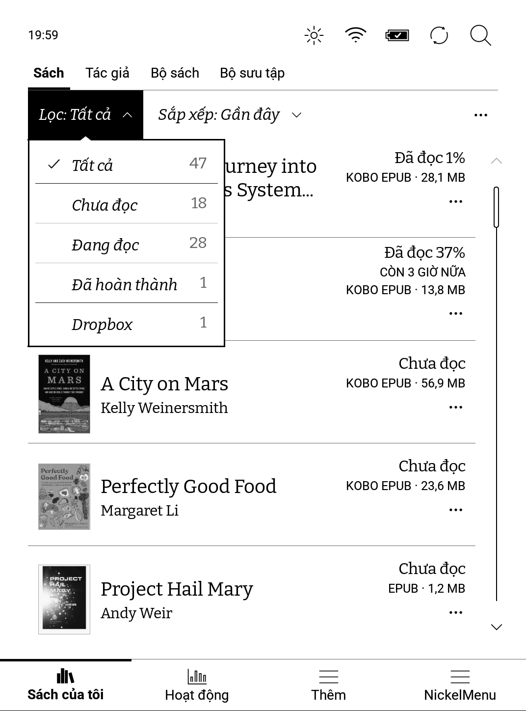
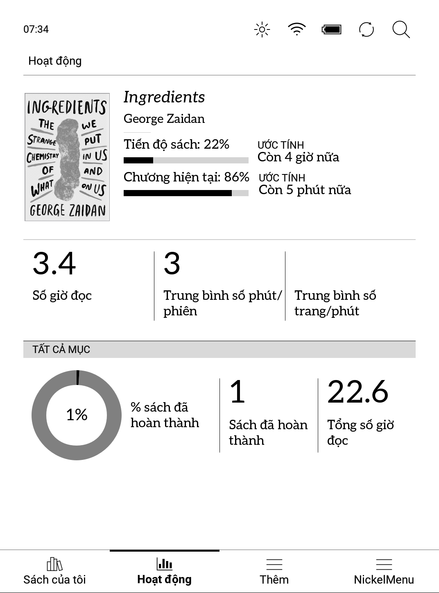
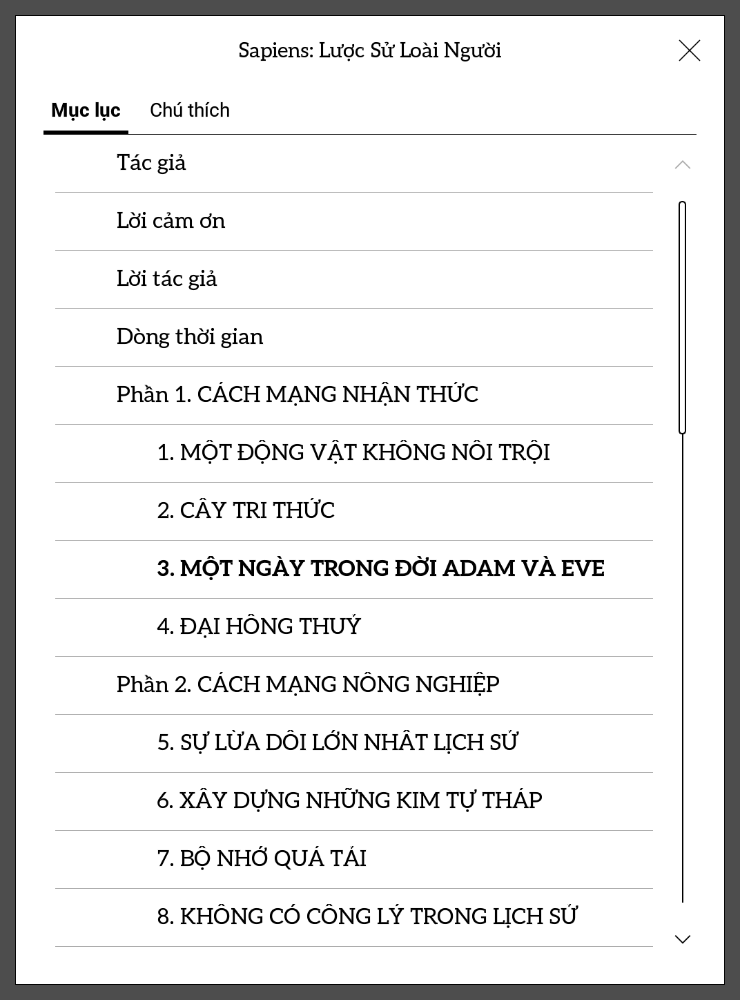
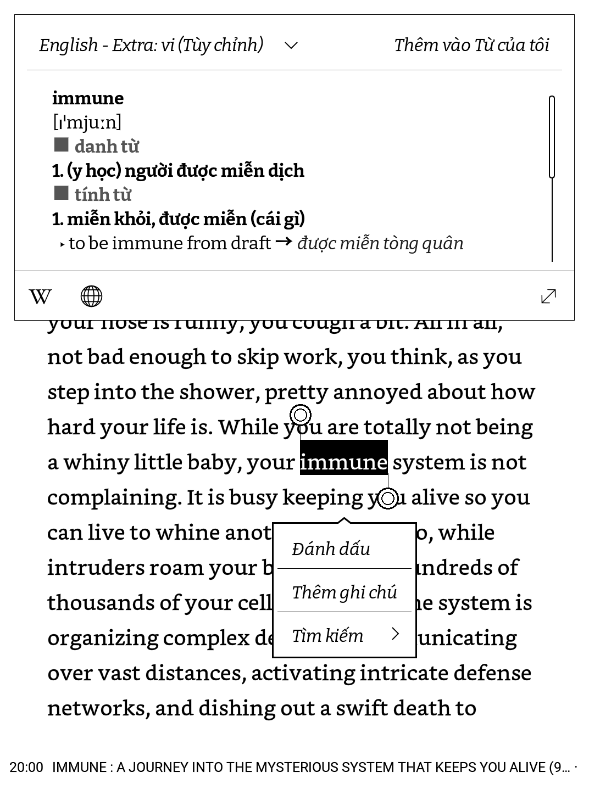
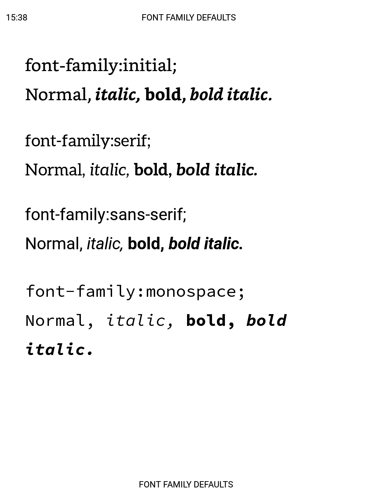

# 🇻🇳 Dự án Kobo tiếng Việt

Có hai vấn đề chính khi sử dụng máy đọc sách Kobo tại Việt Nam:  

1. Máy đọc được eBook tiếng Việt nhưng gặp lỗi hiển thị các phần như tiêu đề, mục lục...
2. Máy không hỗ trợ giao diện tiếng Việt (nếu người dùng cần)

Dự án này được tạo ra để khắc phục hai vấn đề trên.  

Bản cài đặt *hoàn toàn miễn phí* này cung cấp giao diện tiếng Việt và sửa lỗi hiển thị tiếng Việt trên các máy đọc sách Kobo.

## 🔥 1. Chức năng của bản cài đặt
- Cung cấp giao diện tiếng Việt cho máy, hơn 3000 câu được dịch, tỉ lệ > 98%
- Sửa lỗi hiển thị tiếng Việt
- Sửa lỗi không hiển thị chính xác font monospace
- Dễ cài đặt, kích thước nhỏ gọn (bé hơn 10MB)
- Hỗ trợ nhiều dòng máy, không phân biệt firmware
- ***Tùy chọn:*** cài đặt thêm từ điển Anh-Việt Lạc Việt/TFlat 170 ngàn từ cho Kobo/Kindle tại [redphx/tudien](https://github.com/redphx/tudien)

Giao diện được dịch dựa trên bản dịch từ ChatGPT, sau đó được chỉnh sửa thủ công cho phù hợp.  
Bạn có thể đóng góp cho dự án bằng cách báo lỗi hoặc đề xuất cải thiện câu chữ của giao diện.  

Xin cảm ơn ♥️

| Trang chủ | Hoạt động | Mục lục |
|:---------:|:---------:|:-------:|
| [](docs/images/screenshot-home.png) | [](docs/images/screenshot-activity.png) | [](docs/images/screenshot-toc.png) |
| [redphx/tudien](https://github.com/redphx/tudien) | Font monospace | Chọn ngôn ngữ |
| [](docs/images/screenshot-dict.png) | [](docs/images/screenshot-monospace.png) | [](docs/images/screenshot-language.png) |

## 🤓 2. Hướng dẫn cài đặt

Theo lý thuyết thì bản cài đặt có thể dùng được trên nhiều dòng máy, không phân biệt firmware.

***Đã cài đặt thành công trên:***

| Thiết bị     | 4.42.23296 | 4.38.23171 |
| ------------ |:----------:|:----------:|
| Clara BW     | ✓          |            |
| Libra Colour | ✓          |            |
| Libra 2      |            | ✓          |

### Các bước cài đặt

1. [Tải file `KoboRoot.tgz`](https://github.com/redphx/kobo-tieng-viet/releases/latest) về máy
2. Kết nối Kobo với máy tính qua cổng USB
3. Chép file `KoboRoot.tgz` vừa tải vào thư mục `.kobo` trên Kobo. Để nguyên, không giải nén, tên file phải là `KoboRoot.tgz`.
  > Nếu bạn dùng macOS và không thấy thư mục `.kobo`, nhấn tổ hợp phím `Cmd + Shift + .` để hiện thư mục ẩn trong Finder
4. Dùng chức năng `Tháo/Eject USB` trên máy tính để ngắt kết nối an toàn, tránh mất dữ liệu
5. Nếu làm đúng, Kobo sẽ tự động cập nhật và khởi động lại. Quá trình này chỉ mất tầm 3 phút. ***Không tắt nguồn khi máy đang cập nhật***.
6. Máy sẽ tự động chuyển sang giao diện tiếng Việt. Nếu không, bạn có thể tự bật bằng cách:  
    `More > Settings > Language and dictionaries > Select your Language > Extra: vi`
7. ***Tùy chọn:*** cài đặt thêm từ điển Anh-Việt Lạc Việt/TFlat 170 ngàn từ tại [redphx/tudien](https://github.com/redphx/tudien)
8. Tặng ⭐️ cho dự án, và giới thiệu bạn bè, người thân về dự án này 🥰
9. Hoàn tất

Khi muốn cập nhật bản cài đặt phiên bản mới, bạn chỉ cần thực hiện lại các bước trên.

## 📖 3. Thông tin font

Bản cài đặt này sẽ thay đổi các font mặc định của máy (không hỗ trợ tiếng Việt) thành các font khác (hỗ trợ tiếng Việt).

|                       | Font hệ thống                             | Font mới                                                             |
| ---------------------:| ----------------------------------------- | -------------------------------------------------------------------- |
| **Serif**             | Rakuten Serif<br>Georgia (firmware cũ)    | [Aleo](https://fonts.google.com/specimen/Aleo)                       |
| **Sans Serif**        | Rakuten Sans<br>Avenir Next (firmware cũ) | [Roboto](https://fonts.google.com/specimen/Roboto)                   |
| **Monospace**         | Không hỗ trợ (*)                          | [Source Code Pro](https://fonts.google.com/specimen/Source+Code+Pro) |
| **Hỗ trợ tiếng Việt** | ✗                                         | ✓                                                                    |

> (*) Khi một ePub dùng `font-family: monospace`, Kobo sẽ tìm một font hệ thống/tùy chọn bắt đầu bằng `Courier `. Tuy nhiên, Kobo không có font nào đáp ứng được tiêu chí trên nên việc hiển thị các chữ `monospace` bị sai. Để sửa lỗi này, bộ cài đặt sẽ chép các font cần thiết vào thư mục font tùy chọn `/fonts`.

Nếu không thích các font này, bạn có thể thay chúng bằng cách cập nhật font mới trong thư mục `fonts` (vẫn giữ nguyên tên), rồi làm theo hướng dẫn bên dưới để tạo lại bản cài đặt.

## 🙋 4. Các câu hỏi thường gặp

- **Cài đặt cái này có làm hư máy không?**  
  > Bản cài đặt chỉ cập nhật font và thêm file ngôn ngữ tiếng Việt cho giao diện, không chỉnh sửa file hệ thống nên khả năng làm hư máy là gần như không có

- Tôi có thể sử dụng bản cài đặt cho Kobo phiên bản nào?
  > Theo lý thuyết thì bản cài đặt tương thích với mọi dòng máy và firmware

- Tôi đã cài bản [lelinhtinh/kobo-tieng-viet](https://github.com/lelinhtinh/kobo-tieng-viet), giờ có thể cài thêm bản này không?
  > Hoàn toàn được, không lỗi lầm gì. Bạn chỉ cần làm theo hướng dẫn ở trên.

- Sau khi cập nhật firmware mới cho Kobo tôi có phải cài đặt lại tiếng Việt không?
  > Có, vì firmware mới sẽ ghi đè các font sửa lỗi tiếng Việt

- Làm sao để biết được phiên bản tiếng Việt đang cài đặt?
  > Xem tại `Thêm > Cài đặt > Về Kobo`

## 👩‍💻 5. Việc cần làm

- [ ] Cải thiện câu chữ
- [ ] GitHub Action để tự động build `KoboRoot.tgz`

## 🛠️ 6. Thông tin dành cho dev

### Cài đặt `lrelease` của Qt

Yêu cầu phải có tool `lrelease` của Qt để chuyển file dịch `.ts` sang `.qm`.  
Đã dùng thành công với [qt@5 trên macOS](https://formulae.brew.sh/formula/qt@5).

- **Windows:** [cài đặt Qt](https://www.qt.io/download-qt-installer-oss) rồi tìm file `lrelease.exe` trong thư mục cài đặt.

- **MacOS:**
    ```sh
    brew install qt@5
    ```

  File sẽ nằm ở vị trí `/opt/homebrew/opt/qt@5/bin/lrelease`

- **Linux:**  
    ```
    sudo apt-get install -y qttools5-dev-tools
    ```
  Sau đó dùng trực tiếp `lrelease`

Sau khi có được file `lrelease`, cấu hình đường dẫn của nó trong file `.env`

### Hướng dẫn cách build

1. Cài [uv](https://docs.astral.sh/uv/) cho Python 3
2. Chạy lệnh để cài các package cần thiết:

    ```bash
    uv sync
    ```

3. Chạy lệnh để build file `dist/KoboRoot.tgz`:

    ```bash
    uv run python build.py
    ```

4. Cài file trên vào Kobo để thử nghiệm

## 🤝 6. Lời cảm ơn
- ChatGPT đã hỗ trợ dịch
- [lelinhtinh/kobo-tieng-viet](https://github.com/lelinhtinh/kobo-tieng-viet) vì các thông tin về cách sửa lỗi font tiếng Việt
- [pipcat/kobo](https://github.com/pipcat/kobo) về tool để xuất file ngôn ngữ hệ thống từ firmware
